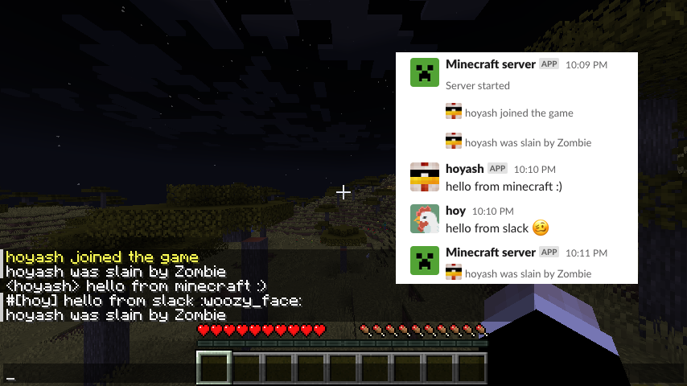
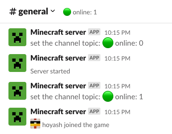
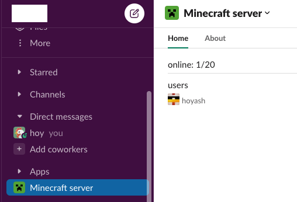

#  Home

<h2>open-source Slack bridge plugin for minecraft server</h2>

## links
[spigot](https://www.spigotmc.org/resources/slack-integration.112181/)  
[Releases](https://github.com/howyi/SlackIntegration/releases)  
[Source Code](https://github.com/howyi/SlackIntegration)  
[Issue Tracker](https://github.com/howyi/SlackIntegration/issues)  

## support
minecraft: 1.20 ~  
bukkit, spigot

## features
!!! note "chat sync (minecraft chat <-> slack channel)"
    

- minecraft player chat  
- player death
- server start/stop
- player join/quit
- slack channel post message

!!! note "minecraft status to Slack Channel topic (dafault off)"
    

!!! note "minecraft online status to Slack App Home"
    