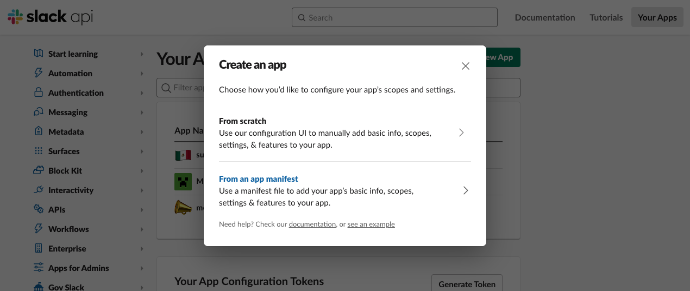
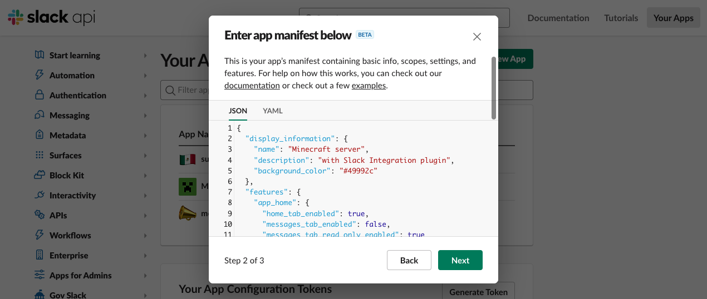
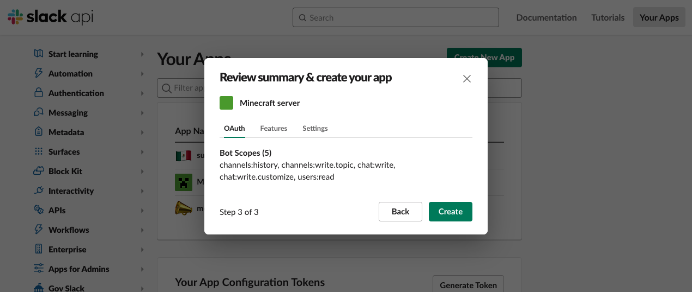
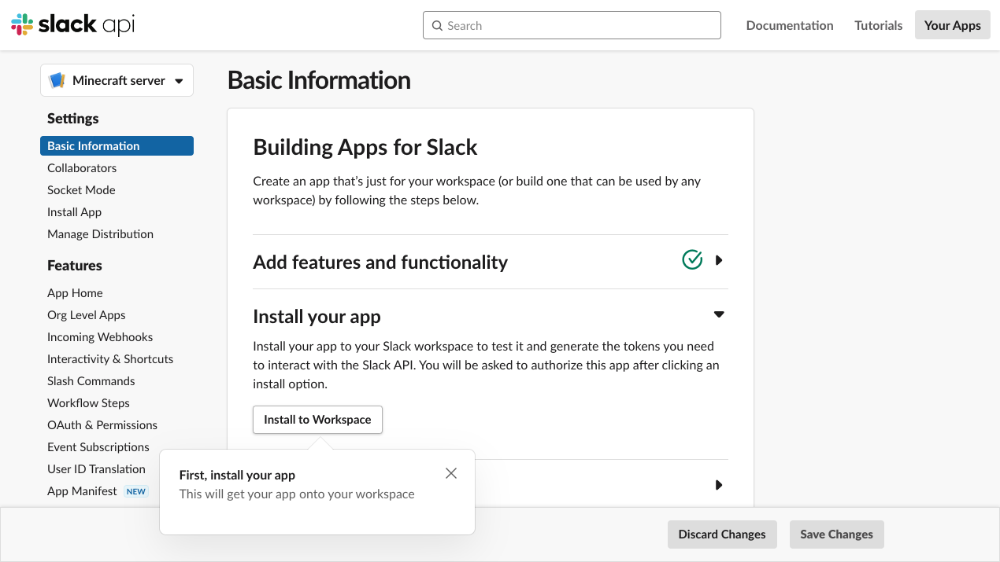

#  Setting up slack app

## Create the New App


create app at [https://api.slack.com/apps](https://api.slack.com/apps) by clicking `"Create New App"`

!!! note "Select `"From an app manifest"`"
    

!!! note "Copy&Paste to App Manifest JSON (JSON is below this image)"
    

```json title="App Manifest"
--8<-- "./docs/app_manifest.json"
```

!!! note "click `"Create"` to confirm"
    

## Set App Icon (optional)
!!! tip ""
    { align=left width="200" }
    Setting the AppIcon to this image will further improve the look of the post when updating the topic 🥴

## Get Oauth Token
!!! note "click `"Install to Workspace"`"
    
!!! note "copy Bot User Oauth Token from "Oauth & Permissions" section"
    

paste to `SlackToken` in `config.yml`

## Get App-Level Token
!!! note "click `"Generate Token and Scopes"` from "Basic Information" section"
    

!!! note "After setting the Name and Scopes as shown in the image, click the `"Generate"`"
    

!!! note "copy Token"
    

paste to `SlackSocketToken` in `config.yml`

## Get Channel Id

!!! note "In slack, right-click on the channel you want to connect and select `"View Channnel Details"`"
    

!!! note "copy the channel ID as they are listed at the bottom of the `"about"` tab."
    

paste to `SlackChannelId` in `config.yml`

## invite bot to Slack Channel
!!! note "On the slack channel you want to connect to, type `/invite` and select `"Add apps to this channel"` add `Minecraft server`."
    