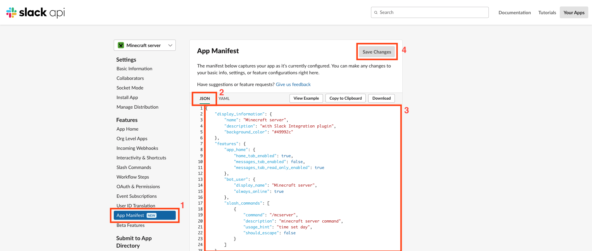

# Update Plugin

## Update config.yml
Please change config to the [latest structure](../config/)

## Update slack app manifest
!!! note "Go to the app_manifest page, change the JSON to the following manifest and save it. After saving, you may be asked to reinstall the app"
    
```json title="App Manifest"
--8<-- "./docs/app_manifest.json"
```